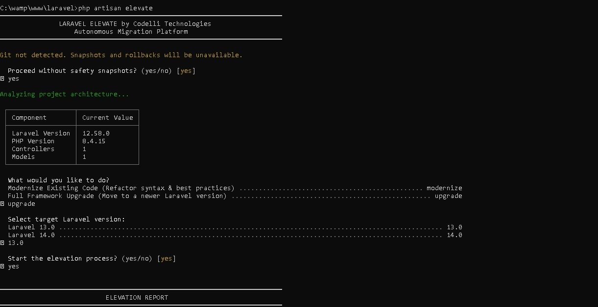

<h1 align="center">
    <b>Laravel Elevate</b><br>
    <span style="font-size: 0.6em;">Developed by Codelli Technologies</span>
</h1>

<p align="center">
    <strong>The Total AI-Driven Transformation & Migration Platform for the Laravel Ecosystem</strong>
</p>

<p align="center">
  
</p>

<p align="center">
    <a href="https://packagist.org/packages/codellitech/laravel-elevate"></a>
    <a href="https://packagist.org/packages/codellitech/laravel-elevate"></a>
    <a href="https://packagist.org/packages/codellitech/laravel-elevate"></a>
</p>

<p align="center">
    Laravel Elevate is an enterprise-grade autonomous modernization engine designed to bridge the gap between legacy Laravel applications and the cutting edge. By leveraging advanced AI reasoning, Elevate doesn't just refactor your syntax—it transforms your entire project architecture, updates your dependency stack, and ensures your application is ready for the future of Laravel.
</p>

---

## 💎 Why Laravel Elevate?

Upgrading legacy Laravel applications is no longer just a refactor—it's a **Transformation**. **Laravel Elevate** is an autonomous migration engine that rebuilds your project's structure, dependencies, and code for the modern era.

---

> [!NOTE]
> **Status**: This project is under **Active Development**. We are continuously adding new AI transformation rules and enterprise modules to help you elevate your application faster.

### 🌟 Total Transformation Features:
- **🏗️ Structural Alignment**: Intelligently moves files and updates architecture to match new Laravel standards.
- **🚀 Target Upgrade Engine**: Choose any target version and watch the AI handle the breaking changes.
- **📦 Dependency Intelligence**: Scans and upgrades your entire `composer.json` stack for full compatibility.
- **🛡️ Safety Snapshot**: Built-in Git-based snapshots with a comprehensive **Elevation Report** and a celebratory "WOOHOO!" finish.
- **🤖 Context-Aware AI**: Specifically handles Migrations, Models, and Controllers with version-specific precision.
- **⚡ Enterprise Modules**: One-click integrations for WhatsApp OTP, with RBAC, SaaS Subscriptions, and Admin Panels coming soon.

---

## 🛠️ Installation

```bash
composer require codellitech/laravel-elevate
```

### System Requirements
- **PHP**: 8.2 or higher
- **Laravel**: 5.0 through 13.x
- **Git**: Highly recommended for safety snapshots

---

## ⚙️ Quick Start

### 1. Initialize
Publish the configuration and add your AI keys to `.env`:

```bash
php artisan vendor:publish --tag="elevate-config"
```

```env
ELEVATE_AI_PROVIDER=gemini
GEMINI_API_KEY=your_key_here
```

### 2. Transform your Project
Run the core engine and follow the interactive prompts to choose your transformation path:
```bash
php artisan elevate
```

### 3. Finalize the Elevation
After the AI finishes the transformation, finalize the dependency installation:
```bash
composer update -W
```

---

## 📖 Commands

| Command | Purpose |
| --- | --- |
| `php artisan elevate` | **Transform/Upgrade**: The main engine for structural and code transformation. |
| `php artisan elevate:integrate` | **Expand**: Automatically injects enterprise modules (WhatsApp OTP, etc). |
| `php artisan elevate:rollback` | **Revert**: Instantly return to the pre-elevation state. |

---

## 🏢 About Codelli Technologies

**Laravel Elevate** is an open-source initiative by **Codelli Technologies**. We build state-of-the-art AI systems and enterprise architecture for the modern web.

- **Website**: [codellitech.in](https://codellitech.in)
- **Support**: [info@codellitech.in](mailto:info@codellitech.in) | [codellitech@gmail.com](mailto:codellitech@gmail.com)

### 👨‍💻 Main Contributor

**Srikanth**  
*Full Stack Developer*  
[LinkedIn](https://www.linkedin.com/in/sri0403) | [Instagram](https://www.instagram.com/srikanth69653)

---

## 📄 License
The MIT License (MIT). Please see [License File](LICENSE.md) for more information.

<p align="center">
  <br>
  Built with ❤️ for the Laravel Community.
</p>
